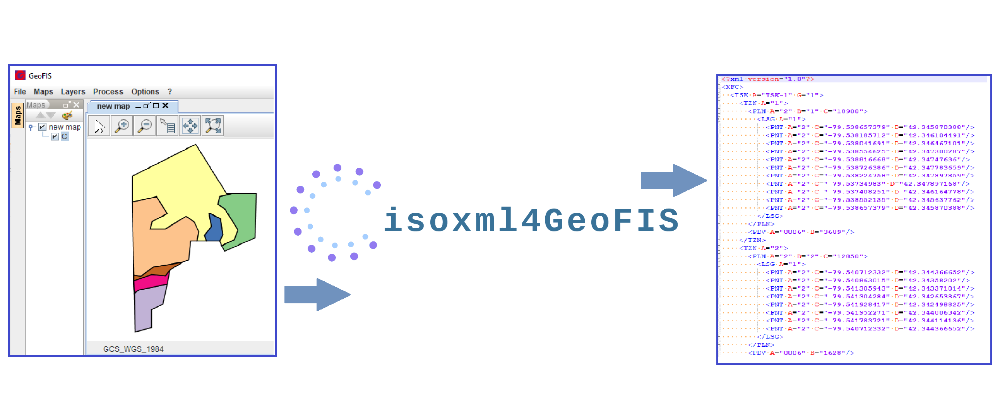

# isoxml4GeoFIS

isoxml4GeoFIS is a software interface to adapt zoning data from GeoFIS to ISOBUS data format.

## Requirements

* GeoFIS v1.1

* R v4.0.5 or higher

* Java 8 or Java 11 of 64 bits.

## Installation

* Copy the folders isobusxmlplg and isobusxmlgrd to plugins folder:

  * On Windows the plugins folder is located in “C:\ProgramData\GeoFIS\plugins\R”. The “C:\ProgramData” folder may be hidden in the file explorer, follow these show hidden files help to display the plugins folder.

  * On Linux the plugins folder is located in “/var/lib/geofis/plugins/R”.

* Restart GeoFIS

